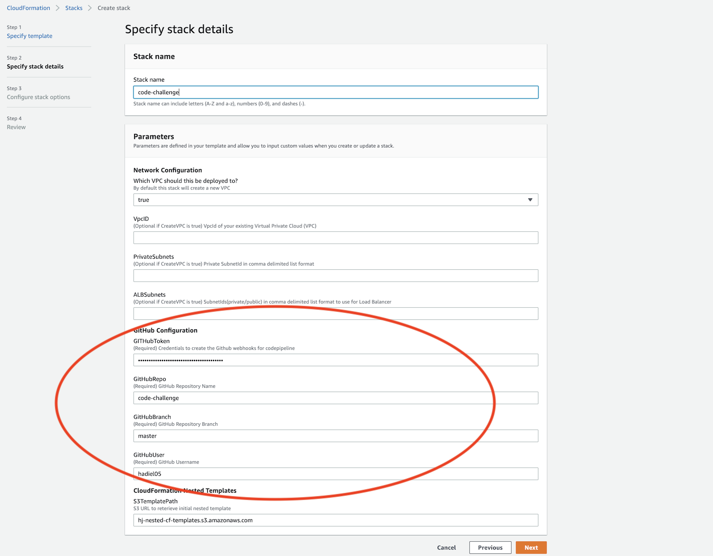

## CI/CD using AWS for a React App 

## How To Run this app locally using docker

1. Install docker on your machine https://docs.docker.com/
### `docker build -f application/Dockerfile -t sample:prod .`
### `docker run -it -p 80:80 --rm sample:prod`

## How To Run this app locally using npm

### `cd application` 
### `npm install`
### `npm start`

## How to Deploy on AWS 

1. Fork or clone this Repo into your own Github account
2. Create a GithHub Token [Create Personal Token](https://help.github.com/en/github/authenticating-to-github/creating-a-personal-access-token-for-the-command-line)
`Set permssion to admin:repo_hook`
3. Login into you aws console account
 - Go to CloudFormation 
    - Create Stack `with new resources(standard)`   
    - Upload the file `templates/parent-template.yaml`
    - Fill in the required Parameters 
    - Run Stack and validate status 

## CI/CD Stages 

## High Level Design 

    
   

