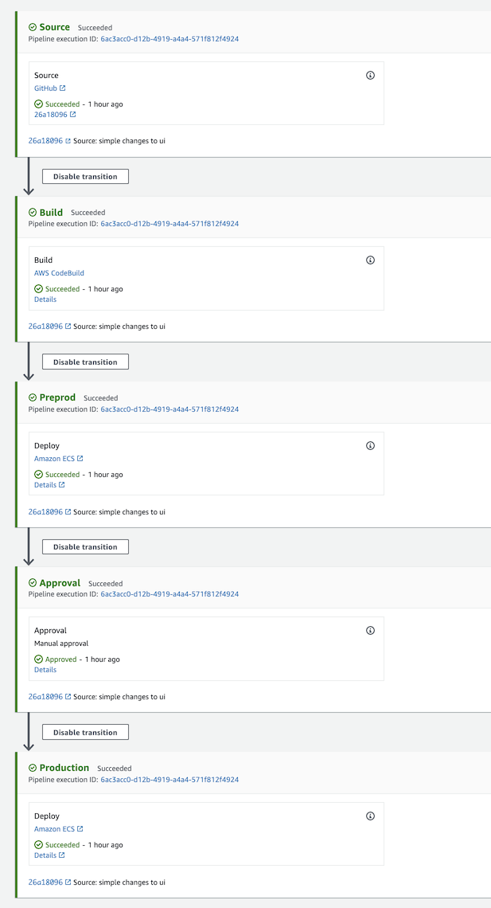

## CI/CD using AWS for a React App 

## Demo Deployed on AWS 
- [Preprod Demo](http://myalb-preprod-1132910257.us-east-1.elb.amazonaws.com)
- [Production Demo](http://myalb-prod-132355218.us-east-1.elb.amazonaws.com)

## How To Run this app locally using docker

1. Install docker on your machine https://docs.docker.com/
### `docker build -f application/Dockerfile -t sample:prod .`
### `docker run -it -p 80:80 --rm sample:prod`

## How To Run this app locally using npm

### `cd application` 
### `npm install`
### `npm start`

## How to Deploy on AWS 

If You DO NOT have a Github Token please do the following steps: 
   - Fork or clone this Repo into your own Github account
   - Create a GithHub Token [Create Personal Token](https://help.github.com/en/github/authenticating-to-github/creating-a-personal-access-token-for-the-command-line)
        ### `Set permssion to admin:repo_hook`

Using the Github Token:
 - Login into you aws console account
 - Go to CloudFormation 
    - Create Stack `with new resources(standard)`   
    - Upload the file `templates/parent-template.yaml`
    - Fill in the REQUIRED Parameters 
    - Run Stack and validate status 
    
## What is created from all the stacks
Templates 
1. templates/deployment-pipeline.yaml -- creates 2 tier network environment 
2. templates/ecs-cluster.yaml -- creates the ecs cluster 
3. templates/service.yaml -- creates the task definition and service to run on ecs fargate 
4. templates/deployment-pipeline.yaml -- create the pipeline, codebuild and roles necessary to deploy to ecs and ecr
5. templates/parent-template.yaml -- Parent stack that runs all the stacks above

Additional information on resources created: 
- VPC if option is selection 
- Two ecs cluters: preprod and production 
    - Two services and Two ALB (separating preprod cluster from production ideally these will be a different vpc or account)
- codepipeline to deploy docker image to ecr and push new created images to ecs 
   - Stages of the pipeline can be seen below 
   - it will only deploy to production with a manual approval
   - all changes that are pushed to github master will trigger the pipeline to build the docker image and any runs the parent stack template

## CI/CD Stages 

## High Level Design 

    
   

